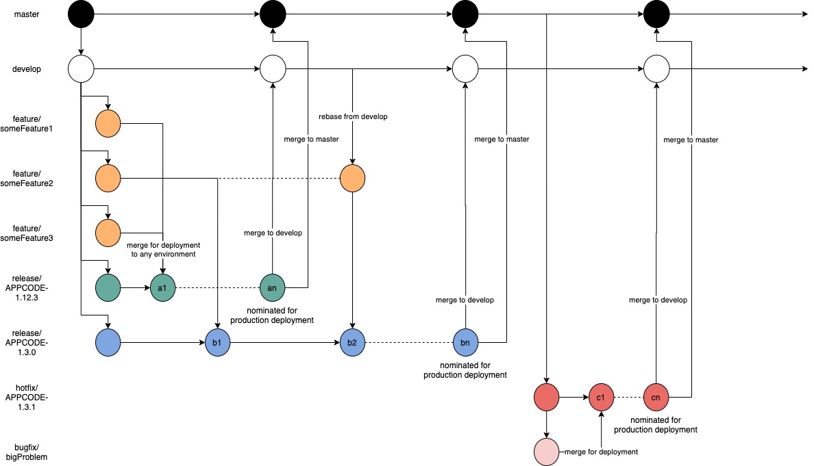

# Omni Git Flow

## Terminology

* **Master Branch** - Protected branch. Must be named "master", must always have passing tests, and is guaranteed to always work in production environments
* **Develop Branch** - Protected branch. Must be name "develop", must always have passing tests, and is guaranteed to always work in production environments
* **Change Branch** - Any branch that introduces changes like a new feature, a bug fix, etc.
* **Source Branch** - The branch that a change branch was created from. New changes in the source branch should be incorporated into the change branch via rebasing.
* **Release Branch** - Used both for short-term preparations of a release, and also for long-term maintenance of older versions.
* **Hotfix Branch** - Used as a release branch for quick production releases. These are the only branches that should use the master branch as the source branch.
* **Merge Target** - A branch that is the intended merge target for a change branch. Typically the merge target branch will be the same as the source branch.
* **Merge Request** -  A means of requesting that a change branch is merged in to its merge target, allowing others to review, discuss and approve the changes.
* **Release** - May be considered safe to use in production environments. Is effectively just a git tag named after the version of the release.

## Diagram

## Flow Specification

The key words “**MUST**”, “**MUST NOT**”, “**REQUIRED**”, “**SHALL**”, “**SHALL NOT**”, “**SHOULD**”, “**SHOULD NOT**”, “**RECOMMENDED**”, “**MAY**”, and “**OPTIONAL**” in this document are to be interpreted as described in **[RFC 2119](https://tools.ietf.org/html/rfc2119)**.

1. The Master Branch
  * A protected branch named "master" MUST exist and it MUST be referred to as the "master branch".
  * The master branch MUST always be in a non-broken state with its test suite passing.
  * The master branch SHALL be guaranteed to always work in production environments.
  * Production versions SHOULD only be taken from the master branch
  * The master branch is maintained by DevOps

2. The Develop Branch
  * A protected branch named "develop" MUST exist and it MUST be referred to as the "develop branch".
  * The develop branch MUST always be in a non-broken state with its test suite passing.
  * The develop branch MUST always be used as the source branch for change branches.
  * The develop branch MUST always be used as the source branch for release branches.
  * The develop branch is maintained by the developer or development team

3. Change branches
  * Each change (feature, bugfix, etc.) MUST be performed on separate branches that SHOULD be referred to as "change branches".
  * All change branches MUST have descriptive names and MUST start with "feature/" or "bugfix/" and it is RECOMMENDED to be followed by the ticket number appended with an underscore to the descriptive name eg. "*feature/MBO-123_BruteForceProtection*"
  * It is RECOMMENDED that you commit often locally, and that you try and keep the commits reasonably structured to avoid a messy and confusing git history.
  * You SHOULD regularly push your work to the same named branch on the remote server.
  * You SHOULD create separate change branches for each distinctly different change. You SHOULD NOT include multiple unrelated changes into a single change branch.
  * When a change branch is created, the branch that it is created from SHOULD be referred to as the "source branch". It is RECOMMENDED that the develop branch be used as the source branch. Each change branch also needs a designated "merge target" branch, this MUST be a release branch.
  * Change branches MUST be regularly updated with any changes from their source branch. This MUST be done by rebasing the change branch on top of the source branch.
  * After updating a change branch from its source branch you MUST push the change branch to the remote server. Due to the nature of rebasing, you will be required to do a force push, and you MUST use the "--force-with-lease" git push option when doing so instead of the regular "--force".
  * If there is a truly valid technical reason to not use rebase when updating change branches, then you can update change branches via merge instead of rebase. The decision to use merge MUST only be taken after all possible options to use rebase have been tried and failed. People not understanding how to use rebase is NOT a valid reason to use merge. If you do decide to use merge instead of rebase, you MUST NOT use a mixture of both methods, pick one and stick to it.
  * It is RECOMMENDED to remove change branches once they have been released. This is to improve maintainability of the list of active branches in the repository.

4. Merge Requests
  * To merge a change branch into its merge target, you MUST open a "merge request" (or equivalent).
  * The purpose of a merge request is to allow others to review your changes and give feedback. You can then fix any issues, complaints, and more that might arise, and then let people review again.
  * Before creating a merge request, it is RECOMMENDED that you consider the state of your change branch's commit history. If it is messy and confusing, it might be a good idea to rebase your branch with "git rebase -i" to present a cleaner and easier to follow commit history for your reviewers.
  * A merge request MUST only be merged when the change branch is up-to-date with its source branch, the test suite is passing, and you and others are happy with the change. This is especially important if the merge target is the develop or master branch.
  * To get feedback, help, or generally just discuss a change branch with others, it is RECOMMENDED you create a merge request and discuss the changes with others there. This leaves a clear and visible history of how, when, and why the code looks and behaves the way it does.

5. Versioning
  * A "version string" is a typically mostly numeric string that identifies a specific version of a project. The version string itself MUST NOT have a "v" prefix, but the version string can be displayed with a "v" prefix to indicate it is a version that is being referred to.
  * The source of truth for a project's version MUST be a git tag with a name based on the version string. This kind of tag MUST be referred to as a "release tag".
  * It is OPTIONAL, but RECOMMENDED to also keep the version string hard-coded somewhere in the project code-base.
  * If you hard-code the version string into the code-base, it is RECOMMENDED that you do so in a file called "VERSION" located in the root of the project. But be mindful of the conventions of your programming language and community when choosing if, where and how to hard-code the version string.
  * If you are using a "VERSION" file in the root of the project, this file MUST only contain the exact version string, meaning it MUST NOT have a "v" prefix. For example "v2.11.4" is bad, and "2.11.4" is good.
  * The version string MUST  follow [Semantic Versioning](VERSIONING.MD).

6. Release Branches
  * Any branch that has a name starting with "release/" SHOULD be referred to as a "release branch".
  * Release branches MUST have a name of "release/VERSION". For example for version "2.11.4" the release branch name MUST be "release/2.11.4". It is RECOMMENDED that the application code followed by a dash be included directly after the "release/" prefix eg. "release/MBO-2.11.4"
  * When using a release branch to create a release, the release tag and if used, version bump commit, MUST be placed directly on the release branch itself.
  * Changes MUST NOT be made on the release branches. All changes MUST be applied to the corresponding change branch and merged into the release branch.
  * After a release tag has been created, the release branch MUST be merged back into its source branch and then deleted. Typically the source branch will be the master branch.
  * If there is a production issue requiring an immediate fix, a hotfix branch will be used in lieu of the release branch. The source branch for this release branch will be the master branch. Hotfix branches MUST start with "hotfix/" instead of "release/".
  * It is RECOMMENDED to remove release branches once they have been released. This is to improve maintainability of the list of active branches in the repository.

7. Bugfixes & Rollbacks
  * You MUST NOT under any circumstances force push to the master branch or to the develop branch.
  * If a change branch which has been merged into the master branch is found to have a bug in it, the bug fix work MUST be done as a new separate change branch and MUST follow the same workflow as any other change branch.
  * If a change branch is wrongfully merged into master, or for any other reason the merge must be undone, you MUST undo the merge by reverting the merge commit itself. Effectively creating a new commit that reverses all the relevant changes.

